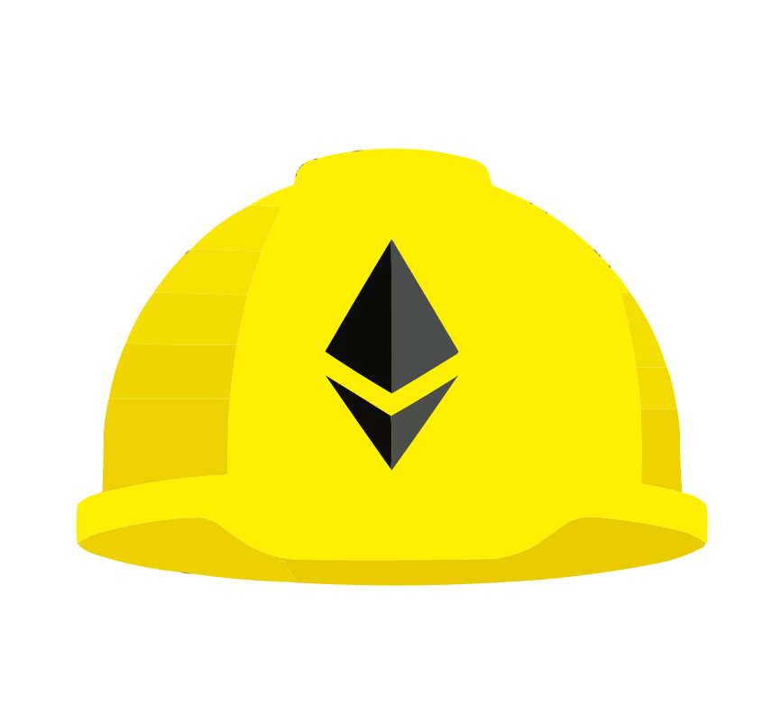

### Hi there, I'm Dipak 👋

 

 - 🔭 I’m currently working on Full Stack Blockchain Application Developoment.
 - 🌱 I’m currently learning Smart Contract Auditing.
 

### Connect with me:

 <a href="https://twitter.com/dipaktapase_eth" target="_blank">  

  
 
  
### Languages and Tools:

<!--  -->

  
  
  
  
  
  
  
  
  
  
  

 

### Github Stats:

 

  

<!-- **dipaktapase/dipaktapase** is a ✨ _special_ ✨ repository because its `README.md` (this file) appears on your GitHub profile.

Here are some ideas to get you started:

- 🔭 I’m currently working on ...
- 🌱 I’m currently learning ...
- 👯 I’m looking to collaborate on ...
- 🤔 I’m looking for help with ...
- 💬 Ask me about ...
- 📫 How to reach me: ...
- 😄 Pronouns: ...
- ⚡ Fun fact: ...
 -->
